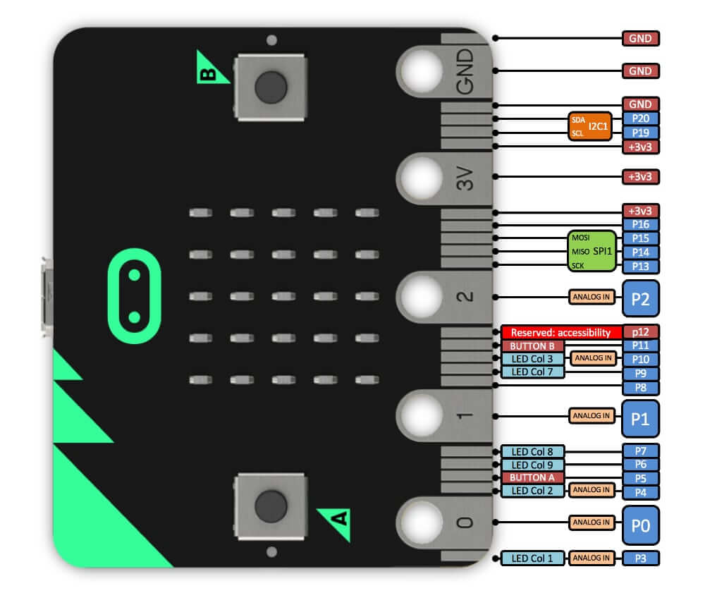
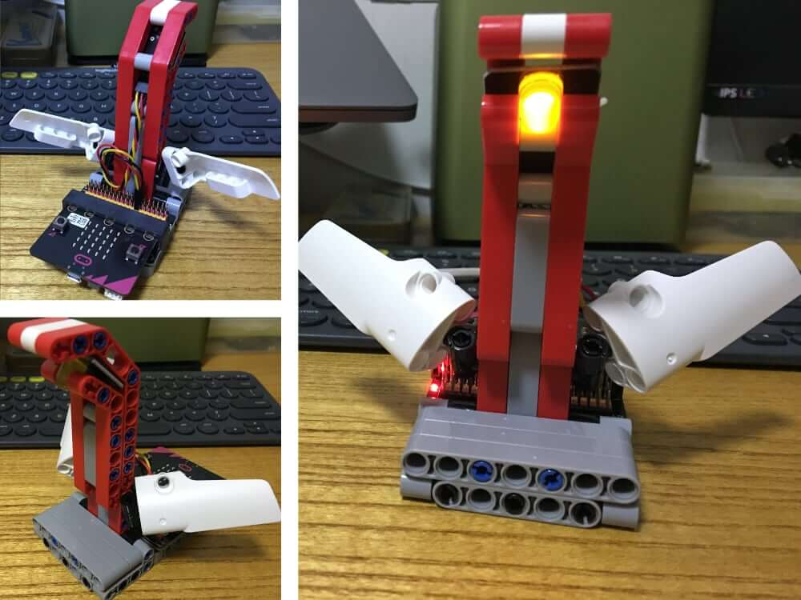

这部分的内容是 micro:bit 最丰富和精彩的部分，了解了引脚和扩展板，就可以把 micro:bit 玩出无限的可能，做个机器手、做辆无人驾驶车、用来自动化控制等等。

## 引脚说明

### 电源引脚

| 引脚 | 说明        |
| ---- | ----------- |
| 3V   | 3V 电源正极 |
| P17  | 3V 电源正极 |
| P18  | 3V 电源正极 |
| GND  | 电源负极    |
| P21  | 电源负极    |
| P22  | 电源负极    |

### 常用引脚

大引脚，可以用鳄鱼夹直接使用，他们通常被称作通用的输入和输出（缩写为 GPIO ）。通过使用一个叫做模拟-数字转换器（ADC）的东西，这 3 个引脚也能够读取模拟电压。

| 引脚 | 说明                              |
| ---- | --------------------------------- |
| P0   | 用于 ADC 和数字 I/O，支持音频输出 |
| P1   | 用于 ADC 和数字 I/O               |
| P2   | 用于 ADC 和数字 I/O               |

### 共享引脚

与其他功能共享的引脚，只有在其他功能不用的情况引脚才具有 I/O 功能。

| 引脚 | 说明                                            |
| ---- | ----------------------------------------------- |
| P3   | 与 LED Col1 共享，关闭屏幕可用于 ADC 和数字 I/O |
| P4   | 与 LED Col2 共享，关闭屏幕可用于 ADC 和数字 I/O |
| P5   | 与按键 A 共享，数字 I/O                         |
| P6   | 与 LED Col9 共享，关闭屏幕可用于数字 I/O        |
| P7   | 与 LED Col8 共享，关闭屏幕可用于数字 I/O        |
| P9   | 与 LED Col7 共享，关闭屏幕可用于数字 I/O        |
| P10  | 与 LED Col3 共享，关闭屏幕可用于 ADC 和数字 I/O |
| P11  | 与按键 B 共享，数字 I/O                         |

### 专用引脚

| 引脚 | 说明                                        |
| ---- | ------------------------------------------- |
| P8   | 发送和感知数字信号                          |
| P12  | 发送和感知数字信号                          |
| P16  | 发送和感知数字信号，通常也用于 SPI 芯片选择 |

### SPI 串行接口总线

| 引脚 | 说明         |
| ---- | ------------ |
| P13  | SCK 时钟信号 |
| P14  | MISO 主信号  |
| P15  | MOSI 从信号  |

### I2C 总线通讯协议

I2C 可以使同一总线连接多个设备，并且从 CPU 上发送或读取信息。micro:bit 内置的**加速度计**和**电子罗盘**连接到了 I2C。

| 引脚 | 说明         |
| ---- | ------------ |
| P19  | SCL 时钟信号 |
| P20  | SDA 数据线   |

!> 通常主要使用 P0、P1、P2、P8、P12、P16 引脚。

## 引脚使用

引脚最主要的功能就是通过编程实现数控的 I/O，例如声音的输入、使用程序控制舵机转向、更多传感器的检测数据输入等等。下面通过两个程序来了解引脚的具体使用。

### 声音

[micro:bit](https://makecode.microbit.org/#pub:_VsPdgfeCkWfJ ":include :type=iframe")

### 舵机（伺服马达）

[micro:bit](https://makecode.microbit.org/#pub:_Xob8uWU62H4X ":include :type=iframe")

## 扩展板

由于 micro:bit 引脚大多数都很小，用于连接线非常的不方便，所以很多公司推出了 micro:bit 专用的扩展板，将引脚导出成方便使用的排针，并且很多扩展板还加入和更多的功能，方便在制作项目时使用，这里主要介绍一块基础的 I/O 扩展板，更多功能的扩展板在之后的项目制作中再做详细介绍。

这块基础的 I/O 扩展板使用排针引出所有引脚，每个引脚都配备电源引脚，方便使用 3P 杜邦连接线来连接外部设备，并且板载一个无源蜂鸣器，可以直接发出声音。同时兼容乐高积木，可以拼接到乐高积木上，搭建有趣的玩具。

接下来就可以开始制作项目了。

### 鹤小灯（自动台灯）

该项目从 [《micro:bit 传感器介绍》](/2018/0520/#亮度级别) 中的自动台灯项目进化而来，使用 LED 发光模块来亮灯，通过引脚来输出灯的亮度控制 LED 发光模块。

| 物料                | 数量 |
| ------------------- | ---- |
| micro:bot 主板      | 1    |
| I/O 扩展板          | 1    |
| LED 发光模块        | 1    |
| 3P 杜邦连接线母对母 | 1    |
| 乐高积木            | 若干 |

[micro:bit](https://makecode.microbit.org/#pub:_Xkbfm2bpjf75 ":include :type=iframe")

