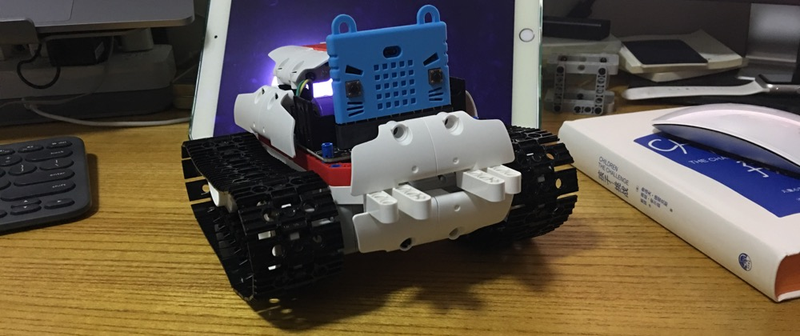

男人总是对车特别的感兴趣，连做项目也要做一个车，还是辆履带装甲车 🤣。先从简单的开始，结合之前对 micro:bit 各种功能的了解，完成一个使用两个 micro:bit 来无线遥控的小车。

## 初步计划

micro:bit 的无线功能，可以通过一块 micro:bit 主板向另一块发送一些信息，来控制另一块主板的一些输出内容。第一个想法是，利用一块 micro:bit 向另一块发送前进、后退以及方向的信息，这样只要手握一块主板，另一块主板链接小车上的马达，就可以实现遥控小车的前进、后退和转向了。

[youku](https://player.youku.com/embed/XMzg0OTI4Mjg1Mg== ":include :type=iframe allowfullscreen height=498")

### 小车

小车就用乐高兼容积木来做，做成什么样子全凭自己的喜好，加装履带是为了比较好实现转向的控制，不使用舵机，就靠两个直流电机对左右两侧轮分别控制前进或后退来现实转向。

### 前进和后退

利用 micro:bit 主板上的加速度传感器，获取到主板往前或往后旋转的角度数，当角度达到某一个值时，就触发前进或后退。

### 转向

利用 micro:bit 主板上的加速度传感器，获取到主板往左或往右翻转的角度数，当角度大于某一个值时，就转向，如果有小车还在前进或后退，则停止一侧轮子来转向，否则就原地打转（两侧轮反向转动）。

## 扩展板

这是一个新的扩展板，专门为智能小车或机器人设计，支持 8 路舵机、4 路直流电机（或 2 路步进电机）、板载无源蜂鸣器、电池、8 个引出的 GPIO 等等。另外还有一点，这个扩展板和之前介绍的同出一家，所以也支持乐高积木，四角有四个乐高积木孔，可以固定在乐高积木搭建的小车上。

1. 5V 外部电源端子（防反接）
2. 电源开关
3. 电源指示灯
4. 电量指示灯
5. MicroUSB 充电口
6. 4 路直流电机 / 2 路 28BYJ 步进电机
7. 蜂鸣器跳线帽
8. 8 路 IO（对应 micro:bit P0-P2、P8、P12-P15）
9. 5V 与 GND 排针
10. 无源蜂鸣器
11. 8 路舵机 3PIN 接口
12. I2C 接口（可拓展 I2C 模块）
13. 18650 锂电池座
14. 电池保护激活按钮
15. micro:bit 插槽
16. 4 路全彩 RGB
17. 舵机驱动芯片
18. 电机驱动芯片
19. 标准 KittenBot 机器人底盘固定孔
20. 标准乐高孔

有了这块扩展板，就可以来做好多东西了。

### 让 MakeCode 支持扩展板

打开 MakeCode for micro:bit，点击右上角的“齿轮”，选择“扩展”，然后在搜索框内输入“RobotBit”，稍等片刻（视网络情况而定），新的编程积木将会出现，选中添加到项目中就可以了。

新的积木主要提供了步进电机、直流电机、舵机等扩展板载接口的支持，可以直接选用。

## 编程

遥控编程必须使用到无线电功能，关于无线功能的介绍，可以看[《micro:bit 无线通讯》](/2018/0515/)了解。整个程序分为两个部分单独编程，一是遥控部分，二是小车控制部分。

### 遥控部分

#### 思路

1. 记录初始角度，用做后面监测 mirco:bit 主板旋转或翻滚角度的比较值
2. 按下 A 键启动遥控和小车，开始加速度传感器的监测
3. 按下 B 键可以关闭遥控和小车，停止监测
4. 时刻监测旋转或翻滚角度的变化，超过 20 的变化量就触发遥控行为
5. 发送遥控值，参照下表，发送数字内容

| 遥控值 | 说明         |
| ------ | ------------ |
| -100   | 关机         |
| 0      | 停止所有运动 |
| 10     | 前进         |
| -10    | 后退         |
| 11     | 前进左转     |
| -11    | 后退右转     |
| 9      | 前进右转     |
| -9     | 后图左转     |
| 1      | 快速原地右转 |
| -1     | 快速原地左转 |

#### 特别注意

micro:bit 主板上的加速度传感器可以监测到主板上下旋转或左右翻滚的角度，当主办正面朝上水平放置在做面上，旋转和翻滚角度都为 0。当主板玩前面旋转时，旋转值从 0 月（小于 0， 越来越不小），反之往后旋转则值越来越大（大于 0）；当主板往左翻滚主板，翻滚值从 0 越来越大，反之则越来越大。

[micro:bit](https://makecode.microbit.org/#pub:_1c13m2d19L94 ":include :type=iframe")

### 小车控制部分

#### 思路

1. 接收到遥控控制值后，立刻改变车轮转向
2. 根据新的车轮转向参数，调整行驶方式以符合遥控
3. 接受遥控控制值与车轮转向对照下表

| 控制值 | 遥控说明     | 车轮转向                       |
| ------ | ------------ | ------------------------------ |
| -100   | 关机         | 所有车轮都不转                 |
| 0      | 停止所有运动 | 所有车轮都不转                 |
| 10     | 前进         | 所有车轮往后转                 |
| -10    | 后退         | 所有车轮往前传                 |
| 11     | 前进右转     | 左侧车轮往后转，右侧车轮不转   |
| -11    | 后退左转     | 左侧车轮不转，右侧车轮往前转   |
| 9      | 前进右转     | 左侧车轮往后转，右侧车轮不转   |
| -9     | 后退左转     | 左侧车轮不转，右侧车轮往前转   |
| 1      | 快速原地右转 | 左侧车轮往前转，右侧车轮往后转 |
| -1     | 快速原地左转 | 左侧车轮往后转，右侧车轮往前转 |

[micro:bit](https://makecode.microbit.org/#pub:_UcfPCq8joHyD ":include :type=iframe")

### 完整程序

分别将两部分程序传至两块 micro:bit 主板上，一块主板插入扩展板的插槽中，并且固定到乐高兼容积木小车上，把直流电机的连接线与 micro:bit 上的直流电机接口连接上，注意，控制左边履带的电机要链接到 M2A 上，控制右边履带的点击链接到 M1B 上，注意正负极。

充当遥控器的 micro:bit 需要接上一个电源，就可以带上小车出去嗨了！

### 组装小车

#### 物料

| 物料                | 数量 |
| ------------------- | ---- |
| micro:bot 主板      | 2    |
| RobotBit 扩展板     | 1    |
| 电池盒              | 1    |
| 2P 杜邦连接线母对母 | 2    |
| 乐高积木            | 若干 |
| 兼容乐高直流马达    | 2    |

拼装过程略，每个人心中都有自己的小车样子，完全可以按照自己的想法来拼装小车。小车拼好以后，将 RobotBit 扩展板固定到预留的位置，用 2P 杜邦连接线将扩展板上直流电机的控制接口与直流马达链接，将任意一块 micro:bit 主板安装到扩展板上，打开电源，另一块 micro:bit 接上电池盒，打开开关，开始玩吧。
