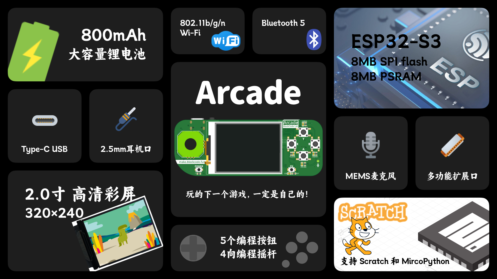

今年又过了三分之一了，终于阶段性完成了第一个硬件项目（个人工作室项目）——开源编程学习机“**Arcade**”。

游戏机可以通过 [图形化编程（Scratch）](https://make.blockcode.fun/ "BlockCode Playground") 和 MicroPython 进行编程，直接制作游戏、动画或小程序，并且通过功能扩展接口连接外设解锁更多玩法——超声波测距、颜色识别、环境监测、舵机、摄像头等等。

游戏机拥有 WiFi 和蓝牙功能，可以直接上网或多人联机（联机稍后推出）。连接互联网后可以利用无限的网络资源实现更多的应用：信息查询、智能家居控制、网络图像和视频 等等功能。

内置麦克风和耳机接口，可以录音和播放声音，并且与网络连接后更可以实现语音识别、文字转语音、翻译等等更多 AI 功能。

更多信息，明天（5月1日）在[工作室网站](https://lab.blockcode.fun/)有详细产品发布介绍。
